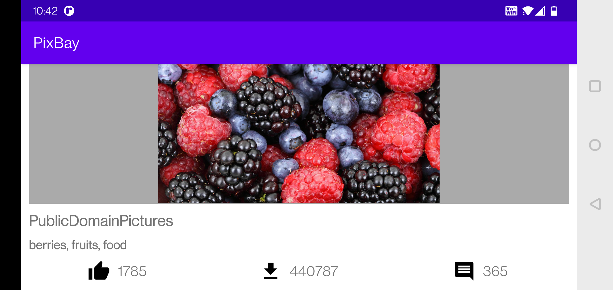

**PixBay** is a sample  📱 built to demonstrate use of *Modern Android development* tools.

## About
It simply loads data from API. Data will be always loaded from local database. Remote data (from API) and Local data is always synchronized.
- This makes it offline capable 😃.
- Clean and Simple Material UI.
- It supports dark theme too 🌗.

*PixBay API is used in this app.

## Built With 🛠
- [Kotlin](https://kotlinlang.org/)
- [Coroutines](https://kotlinlang.org/docs/reference/coroutines-overview.html) - For asynchronous and more..
- [Android Architecture Components](https://developer.android.com/topic/libraries/architecture) - Collection of libraries that help you design robust, testable, and maintainable apps.
    - [LiveData](https://developer.android.com/topic/libraries/architecture/livedata) - Data objects that notify views when the underlying database changes.
    - [ViewModel](https://developer.android.com/topic/libraries/architecture/viewmodel) - Stores UI-related data that isn't destroyed on UI changes.
    - [ViewBinding](https://developer.android.com/topic/libraries/view-binding) - Generates a binding class for each XML layout file present in that module and allows you to more easily write code that interacts with views.
- [Dependency Injection](https://developer.android.com/training/dependency-injection) -
    - [Hilt-Dagger](https://dagger.dev/hilt/) - Standard library to incorporate Dagger dependency injection into an Android application.
- [Retrofit](https://square.github.io/retrofit/) - A type-safe HTTP client for Android and Java.
- [Moshi](https://github.com/square/moshi) - A modern JSON library for Kotlin and Java.
- [Moshi Converter](https://github.com/square/retrofit/tree/master/retrofit-converters/moshi) - A Converter which uses Moshi for serialization to and from JSON.
- [Coil-kt](https://coil-kt.github.io/coil/) - An image loading library for Android backed by Kotlin Coroutines.
- [Material Components for Android](https://github.com/material-components/material-components-android) - Modular and customizable Material Design UI components for Android.

# Package Structure

    com.vp.loyaltypartner    # Root Package
    .
    ├── data                # For data handling.
    │   ├── local           # Local Persistence Database. Room (SQLite) database
    |   │   ├── dao         # Data Access Object for Room   
    │   ├── remote          # Remote Data Handlers     
    |   │   ├── api         # Retrofit API for remote end point.
    |   ├── model           # Model classes
    │   └── repository      # Single source of data.
    |
    ├── di                  # Dependency Injection
    │   └── module          # DI Modules
    |
    ├── ui                  # Activity/View layer
    │   ├── main            # Main Screen Activity & ViewModel
    |   │   ├── adapter     # Adapter for RecyclerView
    |   │   └── viewmodel   # ViewHolder for Activity   
    │   └── content         # Content Screen Activity and ViewModel
    |
    └── utils               # Utility Classes

## Architecture
This app uses [***MVVM (Model View View-Model)***](https://developer.android.com/jetpack/docs/guide#recommended-app-arch) architecture.

